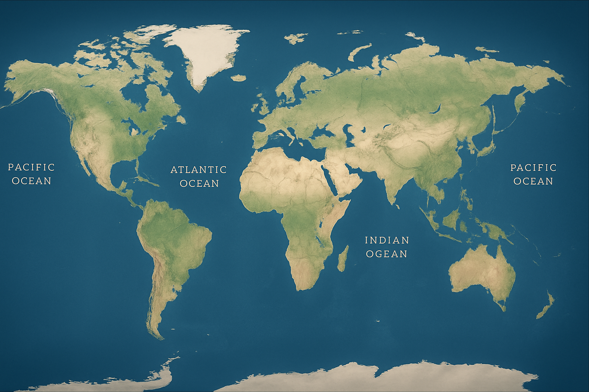

<div align="center">

# ⚓ OceanRoute Nav
### Intelligent Maritime Navigation & Logistics System



[](https://isocpp.org/)
[](https://www.sfml-dev.org/)
[](LICENSE)
[]()

**Navigate the Seven Seas with Algorithms.**  
*A high-performance, STL-free C++ application for optimizing global maritime logistics.*

[Explore Features](#-key-features) • [Installation](#-setup--build) • [Development Stats](#-development-time)

</div>

---

## 🌊 About The Project

**OceanRoute Nav** represents the intersection of algorithmic complexity and interactive visualization. Designed for logistics managers and maritime enthusiasts, it solves the complex problem of finding optimal sea routes across a network of international ports.

Unlike standard navigation tools, this project is built **entirely from scratch** without the use of the C++ Standard Template Library (STL). Every data structure—from the graph representing the ocean network to the priority queues driving the pathfinding—is custom-implemented, demonstrating a deep understanding of computer science fundamentals.

### 🎯 Core Objectives
*   **Optimization:** Balance cost vs. time for cargo delivery.
*   **Visualization:** Render real-time search algorithms on an interactive world map.
*   **Simulation:** Manage port congestion and docking schedules dynamically.

---

## 🚀 Key Features

| Feature | Tech | Description |
| :--- | :---: | :--- |
| **🧠 Intelligent Pathfinding** | `Dijkstra` | Calculates the absolute cheapest or fastest route with millisecond precision. |
| **🕸️ Global Network** | `Adjacency List` | Ports act as nodes connected by weighted edges representing sea routes. |
| **📅 Schedule Management** | `Linked Lists` | Handles complex multi-leg journeys (e.g., Karachi → Dubai → Athens). |
| **🚦 Traffic Control** | `FIFO Queue` | Simulates port congestion; ships wait in queue if docks are full. |
| **🎨 Interactive UI** | `SFML` | Beautiful, hardware-accelerated 2D visualization with hover effects and animations. |
| **🔍 Custom Filters** | `Sub-graphing` | Filter routes by specific shipping companies (e.g., Maersk) or avoid specific ports. |

---

## 📸 Visual Showcase

### 🗺️ Pathfinding Visualization
*Watch as the algorithm explores connections in real-time, highlighting the optimal path in gold.*

### 📍 Interactive Ports
*Hover over any port to see docking fees, waiting ships, and available connections.*

---

## ⏱️ Development Time

We take pride in the effort poured into this project.

| Metric | Value |
| :--- | :--- |
| **📅 Start Date** | December 1, 2024 |
| **⏱️ Coding Hours** | **~50+ Hours** |
| **💻 Lines of Code** | 2,500+ |
| **🔄 Last Updated** | December 5, 2025 |

> *Note: "Coding Hours" represents focused development time excluding planning and research.*

---

## 🛠️ Tech Stack & Architecture

*   **Language:** C++11 (No STL)
*   **Graphics:** SFML 2.6
*   **Build System:** CMake / MinGW
*   **Architecture:** Modular (Logic, Data, UI separation)

---

## ⚙️ Setup & Build

### Prerequisites
*   C++ Compiler (MinGW/GCC recommended)
*   SFML Library
*   CMake

### 📥 Installation

1.  **Clone the repository**
    ```bash
    git clone https://github.com/i243137-oss/OceanRoute-Nav.git
    cd OceanRoute-Nav
    ```

2.  **Compile**
    ```bash
    g++ src/main.cpp -o OceanRouteNav -I include -L lib -lsfml-graphics -lsfml-window -lsfml-system
    ```
    *(Or use the provided `build` script if available)*

3.  **Run**
    ```bash
    ./OceanRouteNav
    ```

---

## 📂 Configuration

Modify `ports.txt` or `Routes.txt` to expand the world:
*   `Routes.txt`: `Origin Destination Date Time Cost Company`
*   `ports.txt`: `PortName X_Coord Y_Coord Daily_Fee`

---

<div align="center">

### 🤝 Contribution
*Built with ❤️ by the Open Source Community.*  
[Report Bug](https://github.com/i243137-oss/OceanRoute-Nav/issues) • [Request Feature](https://github.com/i243137-oss/OceanRoute-Nav/issues)

</div>
